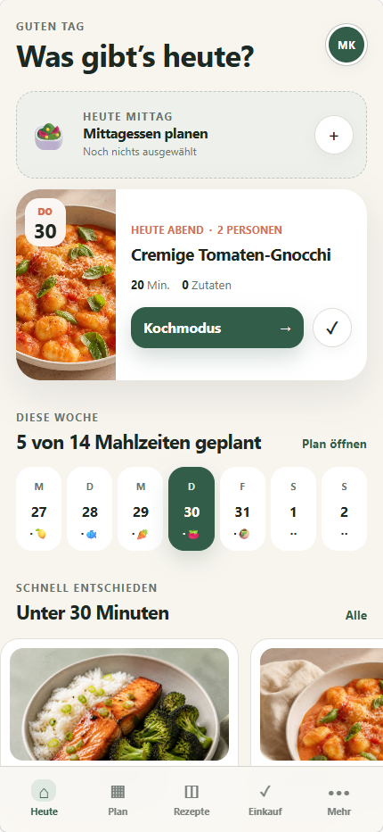

# Mahlzeit

Eine für das iPhone optimierte, selbst gehostete Essensplanung unter .NET 10.

## Enthalten

- Wochenplan mit getrennten Slots für Mittag- und Abendessen
- Automatische Vorschläge mit getrennt einstellbarem Wochenumfang
- Gespeicherte Haushalts-, Ernährungs- und Kochzeiteinstellungen
- Rezeptverwaltung mit Zutaten und Kochschritten
- Dauerhafte Rezeptfavoriten mit Filter und bevorzugter Auswahl
- Instagram-Import aus öffentlichen Post-/Reel-Links oder kopierten Bildunterschriften
- Rezeptbilder als Binärdaten direkt in PostgreSQL
- Automatisch aggregierte und dauerhaft abhakbare Einkaufsliste
- Schrittweiser Kochmodus mit optionaler Bildschirm-Wachhaltung
- Anmeldung mit ASP.NET Core Identity und Passkey-Unterstützung
- Installierbare PWA für den iPhone-Home-Bildschirm
- Docker-Compose-Konfiguration für Synology Container Manager

Automatische Vorschläge berücksichtigen Ernährungsform, Allergien, ausgeschlossene Zutaten, bevorzugte Rezept-Tags, Standardportionen sowie getrennte Zeitlimits für Werktage und Wochenende.

Beim Instagram-Import entsteht immer zuerst ein bearbeitbarer Entwurf. Falls Instagram die öffentliche Bildunterschrift nicht ausliefert, kann der Text direkt aus der Instagram-App kopiert und eingefügt werden. Ein Instagram-Login oder Zugriffstoken ist nicht erforderlich; Bilder werden nur gespeichert, wenn sie selbst hochgeladen werden.



## Lokal mit Docker starten

1. In `.env` ein langes, zufälliges Datenbankpasswort setzen.
2. `docker compose up -d` ausführen.
3. `http://localhost:8088` öffnen und den ersten Zugang registrieren ("Ersten Haushalt anlegen").

Die Datenbankmigrationen und die Beispieldaten werden beim ersten Start automatisch angelegt.

## Installation auf einer Synology

Voraussetzung ist ein Modell, das Synology Container Manager unterstützt.

1. Diesen Projektordner in einen gemeinsamen Ordner auf der NAS kopieren.
2. Eine `.env` mit einem sicheren `POSTGRES_PASSWORD` anlegen.
3. In Container Manager ein neues Projekt aus `compose.yaml` erstellen.
4. Nach dem Start intern Port `8088` aufrufen.
5. Im DSM-Reverse-Proxy eine HTTPS-Adresse auf `http://127.0.0.1:8088` weiterleiten.
6. Die fertige HTTPS-Adresse in Safari öffnen und über **Teilen → Zum Home-Bildschirm** installieren.

Der PostgreSQL-Port wird nicht nach außen veröffentlicht. Anmeldeschlüssel bleiben über das Volume `mealprep-keys` auch bei Container-Neustarts erhalten.

## Versioniertes Docker-Image als TAR erstellen

Der Cake-Build ermittelt die aktuelle Version mit GitVersion, baut
`mealprep-app:<version>` und exportiert dieses Image anschließend als TAR-Datei.
Der Build verwendet das dateibasierte Cake.Sdk für .NET 10. Die Cake-Version ist
direkt in `build.cs` festgeschrieben. GitVersion wird durch Cake über
`InstallTools(...)` bereitgestellt.
Die ermittelte Version wird außerdem an `dotnet publish` übergeben und auf der
Einstellungsseite aus den Assembly-Metadaten angezeigt.

```sh
dotnet build.cs
```

Die Datei wird unter `artifacts/docker/mealprep-app-<version>.tar` abgelegt und
kann beispielsweise auf die Synology kopiert und dort geladen werden:

```sh
docker load -i artifacts/docker/mealprep-app-<version>.tar
```

Image-Name, Ausgabeordner und Zielplattform lassen sich überschreiben:

```sh
dotnet build.cs -- --target Docker-Export \
  --image-name mealprep-app \
  --output-directory artifacts/docker \
  --platform linux/amd64
```

Git-Tags wie `v1.2.3` ergeben das Image `mealprep-app:1.2.3`. Bei noch nicht
getaggten Commits wird die Build-Metadaten-Version in einen Docker-kompatiblen
Tag umgewandelt, beispielsweise `0.1.0+12` zu `0.1.0-build.12`.

## Docker-Image auf GitHub veröffentlichen

Nach der Anmeldung bei der GitHub Container Registry kann der Cake-Task das
versionierte Image unter `ghcr.io/<github-owner>/mealprep-app:<version>`
veröffentlichen:

```sh
docker login ghcr.io
dotnet build.cs -- --target Docker-Push --github-owner <github-owner>
```

In GitHub Actions wird der Besitzer automatisch aus
`GITHUB_REPOSITORY_OWNER` gelesen. Mit `--github-image-name` lässt sich der
Paketname ändern. `--push-latest` veröffentlicht zusätzlich den Tag `latest`:

```sh
dotnet build.cs -- --target Docker-Push \
  --github-owner <github-owner> \
  --github-image-name mealprep \
  --push-latest
```

Der Task führt keine eigene Anmeldung durch und gibt daher keine Zugangsdaten
an Cake weiter. Lokal muss Docker bereits bei `ghcr.io` angemeldet sein; in
GitHub Actions sollte dafür der bereitgestellte `GITHUB_TOKEN` verwendet werden.

## Sicherung

`scripts/backup.sh` erzeugt einen komprimierten, konsistenten PostgreSQL-Dump. Der Ausgabeordner sollte zusätzlich mit Synology Hyper Backup gesichert werden.

Beispiel auf der NAS:

```sh
sh scripts/backup.sh /volume1/docker/mealprep /volume1/backups/mealprep
```

## Entwicklung ohne Docker

Eine lokale PostgreSQL-Datenbank mit folgenden Entwicklungsdaten bereitstellen:

```text
Host=localhost
Database=mealprep
Username=mealprep
Password=mealprep_dev
```

Danach:

```sh
dotnet run --project src/MealPrep.App
```

## Tests

```sh
dotnet test MealPrep.slnx
```
